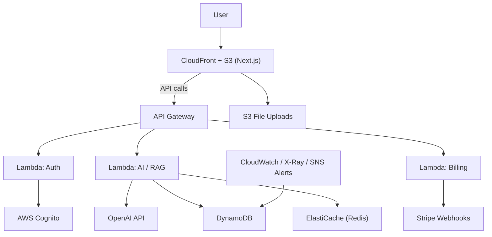

# 🧠 AI Knowledge Vault Pro

A **serverless**, **AI-driven knowledge analysis** and **summarization platform** — designed to demonstrate **full-stack and cloud architecture mastery**.

---

## 🪶 Overview

**AI Knowledge Vault Pro** is a full-stack serverless application that allows users to upload documents, ask questions, and receive **AI-generated summaries or insights**.

It integrates **LLM (GPT-4o)** with user-owned knowledge bases through **RAG (Retrieval-Augmented Generation)**, combining **AWS Serverless architecture**, **Terraform IaC**, and **Stripe billing**.

> This project demonstrates **Senior Developer–level expertise** in architecture, scalability, DevOps automation, and AI integration.

---

## 🌍 Live Demo

👉 **Demo Link:** _Coming Soon_

---

## 🧾 Architecture Diagram (Mermaid)



---

## 🧩 Core Features

### 🔐 Authentication & Authorization
- AWS Cognito User Pool with **Google OAuth 2.0 federated login**.  
- **JWT-based authentication** between frontend and backend.  
- Integrated with **next-auth** or **Amplify** for seamless session handling.  

### 💳 Membership & Billing System
- **Free users:** Daily quota (e.g., 10 analyses per day).  
- **Paid tiers (Pro, Premium):**
  - Unlimited usage  
  - Access to **GPT-4o**  
  - Faster response rate  

**Stripe Checkout + Portal Integration**
- Webhooks update DynamoDB membership state.  
- Supports renewals, cancellations, and plan upgrades.  
- Quota auto-reset via **CloudWatch + Lambda job**.  

### 🤖 AI & RAG Integration
- Integration with **OpenAI GPT-4o / GPT-4o-mini**.  
- **RAG Pipeline:**  
  - File upload → text chunking → vector embedding → semantic retrieval  
  - Stored in DynamoDB / S3  
- **Redis (ElastiCache)** caching layer for prompt reuse.  
- Tier-based model selection & rate limiting.  

---

## 🗂️ Data Architecture

| Table | Purpose | Key Attributes |
|--------|-----------|----------------|
| **UserProfile** | Store plan type, quota, Stripe ID | `userId`, `planType`, `remainingQuota` |
| **UsageLog** | Daily usage tracking (with TTL cleanup) | `userId`, `timestamp` |
| **AIQueryCache** | Store cached AI responses | `promptHash`, `ttl` |

---

## 🧠 Cost Control
- Use **GPT-4o-mini** for free users; **GPT-4o** for Pro tier.  
- Automatic quota enforcement in Lambda.  
- **CloudWatch cost metrics + SNS alerts** for monitoring.  

---

## 🏗️ Architecture Overview

### AWS Components
- **API Gateway** — Request routing  
- **Lambda** — Modular backend functions (auth, billing, ai, analytics)  
- **DynamoDB** — Persistent data store  
- **ElastiCache (Redis)** — AI cache layer  
- **Cognito** — Authentication & federated identity  
- **S3 + CloudFront** — Frontend hosting & file uploads  
- **CloudWatch + SNS** — Logging, alerts, and scheduled jobs  
- **QuickSight** — Visualized analytics  
- **Stripe** — Billing & membership management  

### Infrastructure as Code (Terraform)
Organized by modular structure:
- `auth` → Cognito + Google Provider  
- `billing` → Stripe + Webhooks + DynamoDB updates  
- `ai` → Lambda + OpenAI + Redis  
- `infra` → IAM, API Gateway, CloudWatch  

---

## 💻 Frontend (Next.js + TypeScript)

| Page | Description |
|-------|-------------|
| `/login` | Google Sign-in via Cognito |
| `/dashboard` | User info, plan type, remaining quota (SSR) |
| `/analyze` | Upload file, interact with AI, see summaries |
| `/history` | View past analyses (from DynamoDB) |

**Tech Highlights**
- App Router + Server Actions  
- Server Components with SSR for dashboard  
- Protected routes via JWT session  
- i18n (繁體中文 / English)  
- Tailwind UI (Dark / Light themes)  

---

## ⚙️ DevOps & CI/CD Pipeline

**GitHub Actions**
- Frontend: Build → Deploy to S3 + CloudFront  
- Backend: Terraform plan → PR comment → `terraform apply` on merge  
- Auto-preview environments for PR branches  

**Monitoring & Observability**
- **AWS X-Ray:** End-to-end request tracing  
- **CloudWatch + SNS:** Error alerts  
- **QuickSight:** Visualized DynamoDB usage  

---

## 🧱 Terraform Resources

| Resource | Description |
|-----------|-------------|
| Cognito User Pool | Authentication + Google Federation |
| Lambda Functions | Auth / Billing / AI / Quota Reset / Webhooks |
| API Gateway | Route management |
| DynamoDB | User & usage data |
| S3 + CloudFront | Frontend & storage |
| ElastiCache | AI Cache Layer |
| CloudWatch | Logs, Metrics, Scheduled Jobs |
| SNS | Alerts & Notifications |

---

## 🔍 Technical Highlights

✅ **Serverless Architecture** — Event-driven, scalable, minimal ops overhead  
✅ **RAG Pipeline** — Demonstrates embeddings, retrieval, and LLM integration  
✅ **Stripe Integration** — Real-world subscription + webhook reliability  
✅ **Terraform Modularization** — Reusable IaC design  
✅ **DevOps Automation** — GitHub Actions + Terraform validation  
✅ **Monitoring & Cost Control** — CloudWatch + X-Ray + QuickSight  
✅ **Multi-language Frontend** — SSR, TypeScript, i18n  

---

## 📈 Future Enhancements

- Chat memory context per user session  
- Fine-tuned model selection by user domain  
- Admin dashboard for analytics and plan management  
- Integration with **LangChain** or **OpenAI Assistants API**  

---

## 🧩 Folder Structure (Proposed)

```
/frontend      → Next.js + Tailwind
/backend       → Lambda functions (auth, ai, billing)
/infra         → Terraform modules
/scripts       → Deployment / CI utilities
```

---

## 🧑‍💻 Deployment

### Frontend
```bash
npm install
npm run build
npm run deploy
```

### Backend
```bash
cd infra
terraform init
terraform apply
```

---

## 🧭 Author

**Dennis Hsu**  
Senior Full-Stack Developer | Cloud & AI Engineer  

🔗 **Portfolio:** [dennishsu.dev](https://dennishsu.dev)  
📧 **Contact:** dennis@example.com
